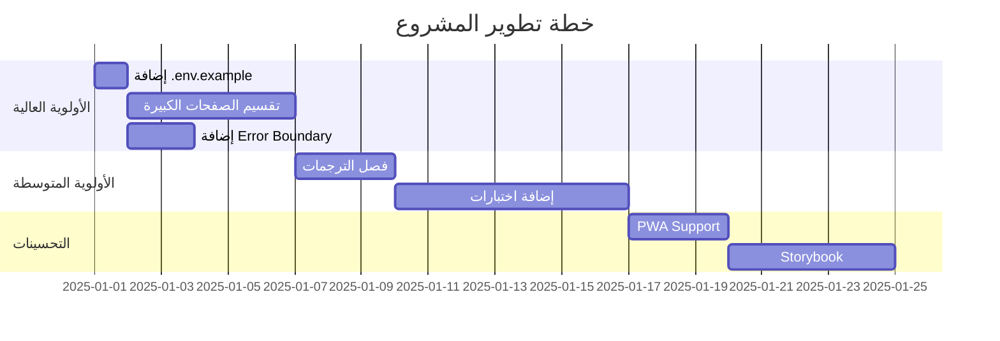

# 📊 تقرير المراجعة الشاملة لمشروع "أحمد قاعود" Portfolio

> **تاريخ المراجعة:** 28 ديسمبر 2025  
> **المراجع:** Antigravity Assistant  
> **نوع المراجعة:** تحليل عميق شامل

---

## 🔍 نظرة عامة على المشروع

هذا المشروع هو **معرض أعمال احترافي (Portfolio)** للخبير أحمد قاعود، يعمل كـ "المقر الرقمي" الذي يجمع بين:
- الهوية الشخصية (Personal Brand)
- معرض الأعمال والمشاريع
- مركز الخدمات الاستراتيجي

### البنية التقنية المستخدمة:
| المكون | التقنية |
|--------|---------|
| **Frontend** | React + Vite + TypeScript |
| **التصميم** | Tailwind CSS + Shadcn/ui |
| **Backend** | Supabase (Database + Auth) |
| **الأيقونات** | Lucide React |
| **الحالة والبيانات** | TanStack Query |
| **التوجيه** | React Router DOM |
| **SEO** | React Helmet Async |

---

## ✅ نقاط القوة (Strengths)

### 1️⃣ نظام تصميم احترافي متقدم

> [!TIP]
> المشروع يمتلك Design System متكامل ومتقدم

- **لوحة ألوان متقنة:** تستخدم ألوان Navy وGold كهوية بصرية مميزة
- **CSS Variables:** متغيرات CSS منظمة للـ Light و Dark Mode
- **Animations مخصصة:** +10 animations احترافية (shimmer, float, pulse-glow, gradient-shift...)
- **Glassmorphism:** تأثيرات زجاجية حديثة (`.glass`, `.glass-card`)
- **تأثيرات Hover:** (`hover-lift`, `hover-glow`) لتجربة تفاعلية

```css
/* مثال على التأثيرات */
.glow-gold { box-shadow: 0 0 30px hsl(var(--accent) / 0.3); }
.shimmer-bg { animation: shimmer 2s linear infinite; }
```

### 2️⃣ دعم كامل للـ RTL والتوطين

- **نظام i18n مدمج:** ملف `LanguageContext.tsx` يحتوي على +150 ترجمة
- **دعم RTL/LTR تلقائي:** تغيير اتجاه الصفحة بناءً على اللغة
- **خطوط عربية احترافية:** Tajawal للعربية + Poppins للإنجليزية
- **حفظ اللغة المفضلة:** LocalStorage للحفاظ على آخر اختيار

### 3️⃣ بنية ملفات منظمة

```
frontend/
├── src/
│   ├── components/     # 78+ مكون
│   │   ├── ui/         # 49 مكون UI قابل لإعادة الاستخدام
│   │   ├── sections/   # 11 قسم للصفحة الرئيسية
│   │   ├── layout/     # Header, Footer, Layout
│   │   └── ...
│   ├── pages/          # 17 صفحة
│   ├── hooks/          # 3 hooks مخصصة
│   ├── contexts/       # Language Context
│   ├── data/           # بيانات ثابتة (blog, testimonials)
│   ├── integrations/   # Supabase client
│   └── types/          # TypeScript types
```

### 4️⃣ تجربة مستخدم متميزة (UX)

- **صفحات شاملة:** 17 صفحة تغطي كل احتياجات الزائر
- **أدوات تفاعلية:** ROI Calculator، AI Idea Validator، Digital Maturity Assessment
- **Chatbot ذكي:** للتواصل الفوري
- **Scroll Animations:** تحريكات تظهر عند التمرير
- **SEO Component:** تحسين محركات البحث لكل صفحة

### 5️⃣ تكامل Supabase منظم

- **Client منفصل:** ملف واحد للـ Supabase client
- **Types مولدة تلقائياً:** ملف `types.ts` (7.9KB) للـ Database types
- **Auth متكامل:** LocalStorage + Auto Refresh Token

### 6️⃣ مكونات UI قوية (Shadcn/ui)

- **49 مكون Radix UI:** Dialog, Dropdown, Tabs, Toast, Accordion...
- **قابلية التخصيص:** استخدام CVA للتخصيص المتقدم
- **إمكانية الوصول (a11y):** Radix توفر accessibility بشكل افتراضي

---

## ⚠️ نقاط الضعف (Weaknesses)

### 1️⃣ ملفات صفحات ضخمة جداً

> [!WARNING]
> بعض ملفات الصفحات كبيرة جداً وتحتاج تقسيم

| الملف | الحجم | ملاحظة |
|-------|-------|--------|
| `About.tsx` | 40.9 KB | ⚠️ كبير جداً |
| `Contact.tsx` | 32.1 KB | ⚠️ كبير |
| `Projects.tsx` | 31.9 KB | ⚠️ كبير |
| `BookConsultation.tsx` | 29.9 KB | ⚠️ كبير |
| `CaseStudies.tsx` | 27.9 KB | ⚠️ كبير |

**المشكلة:** صعوبة الصيانة، بطء في IDE، إعادة render غير ضرورية

### 2️⃣ غياب الاختبارات

> [!CAUTION]
> لا يوجد أي اختبارات (Unit/Integration/E2E) في المشروع

- لا يوجد مجلد `tests/` أو `__tests__/`
- لا يوجد أي مكتبة اختبار في `package.json`
- لا توجد سكريبتات اختبار في `scripts`

### 3️⃣ كشف مفاتيح API في `.env`

> [!CAUTION]
> ملف `.env` موجود في الـ root ويحتوي على مفاتيح Supabase

- ملف `.env` في الـ root يحتوي على:
  - `VITE_SUPABASE_PUBLISHABLE_KEY`
  - `VITE_SUPABASE_URL`
- **لا يوجد `.env.example`** كنموذج

### 4️⃣ ترجمات مدمجة في الكود

- جميع الترجمات (+150) في ملف `LanguageContext.tsx` واحد
- **الحجم:** 17.4 KB - سيزداد مع إضافة محتوى
- **صعوبة الصيانة:** يجب فصل الترجمات في ملفات JSON منفصلة

### 5️⃣ غياب Error Boundaries

- لا يوجد `ErrorBoundary` component للتعامل مع الأخطاء
- الأخطاء ستؤدي لانهيار التطبيق بالكامل

### 6️⃣ Backend شبه فارغ

```
backend/
└── supabase/
    ├── config.toml (86 bytes)
    ├── functions/  (2 ملفات)
    └── migrations/ (1 ملف)
```

- **Functions:** 2 ملفات فقط (غير معروف محتواها)
- **Migrations:** 1 ملف فقط
- **لا يوجد API routes** أو business logic

### 7️⃣ غياب Loading States موحدة

- لا يوجد Skeleton components
- لا يوجد Loading spinners موحدة
- كل صفحة تتعامل مع Loading بطريقة مختلفة

### 8️⃣ عدم وجود نظام TypeScript Types مركزي

- مجلد `types/` يحتوي على ملف واحد فقط
- أنواع TypeScript موزعة في الملفات

---

## 💡 اقتراحات التطوير (Recommendations)

### 🔴 أولوية عالية (Critical)

#### 1. إضافة `.env.example`
```bash
# .env.example
VITE_SUPABASE_PROJECT_ID="your-project-id"
VITE_SUPABASE_PUBLISHABLE_KEY="your-anon-key"
VITE_SUPABASE_URL="https://your-project.supabase.co"
```

#### 2. تقسيم الصفحات الكبيرة
```
pages/About/
├── index.tsx          # Entry point
├── HeroSection.tsx    # Hero section
├── StorySection.tsx   # Story section
├── TimelineSection.tsx
├── ExpertiseSection.tsx
└── CTASection.tsx
```

#### 3. إضافة Error Boundary
```tsx
// src/components/ErrorBoundary.tsx
class ErrorBoundary extends React.Component {
  // التقاط الأخطاء وعرض رسالة بديلة
}
```

#### 4. فصل الترجمات
```
src/locales/
├── ar/
│   ├── common.json
│   ├── navigation.json
│   └── services.json
└── en/
    └── ...
```

---

### 🟡 أولوية متوسطة (Important)

#### 5. إضافة اختبارات
```json
// package.json
{
  "devDependencies": {
    "vitest": "^1.0.0",
    "@testing-library/react": "^14.0.0",
    "playwright": "^1.40.0"
  }
}
```

#### 6. إضافة Skeleton Components
```tsx
// src/components/ui/skeleton.tsx
export const PageSkeleton = () => (
  <div className="animate-pulse">...</div>
);
```

#### 7. تنظيم TypeScript Types
```
src/types/
├── api.ts        # API response types
├── components.ts # Component prop types
├── forms.ts      # Form data types
└── index.ts      # Re-exports
```

#### 8. إضافة Google Analytics Component
- يوجد ملف `GoogleAnalytics.tsx` - تأكد من تفعيله

---

### 🟢 أولوية منخفضة (Nice to Have)

#### 9. إضافة PWA Support
```json
// vite.config.ts
import { VitePWA } from 'vite-plugin-pwa'
```

#### 10. إضافة Storybook
- لتوثيق المكونات بصرياً
- تسهيل التطوير والاختبار

#### 11. إضافة Changelog
```markdown
# CHANGELOG.md
## [1.0.0] - 2025-12-28
### Added
- Initial release
```

#### 12. تحسين الـ Backend
- إضافة Edge Functions للـ business logic
- إضافة Row Level Security (RLS) policies
- إضافة Triggers للـ automation

---

## 📈 ملخص التقييم

| المعيار | التقييم | ملاحظة |
|---------|---------|--------|
| **بنية الملفات** | ⭐⭐⭐⭐ | منظمة جيداً |
| **نظام التصميم** | ⭐⭐⭐⭐⭐ | احترافي ومتقدم |
| **التوطين (i18n)** | ⭐⭐⭐⭐ | جيد لكن يحتاج فصل |
| **Type Safety** | ⭐⭐⭐ | يحتاج تحسين |
| **الاختبارات** | ⭐ | غائبة تماماً |
| **الأمان** | ⭐⭐⭐ | يحتاج .env.example |
| **الأداء** | ⭐⭐⭐⭐ | جيد مع ملاحظات |
| **تجربة المستخدم** | ⭐⭐⭐⭐⭐ | ممتازة |
| **قابلية الصيانة** | ⭐⭐⭐ | ملفات كبيرة |

### التقييم العام: ⭐⭐⭐⭐ (4/5)

---

## 🎯 خطة العمل المقترحة



---

*تم إنشاء هذا التقرير بواسطة Antigravity Assistant*  
*جميع الحقوق محفوظة © 2025 أحمد قاعود*
